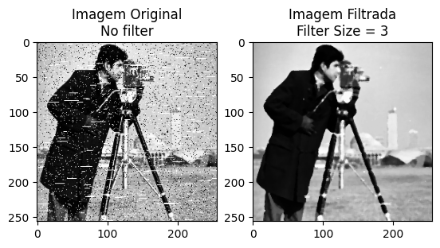
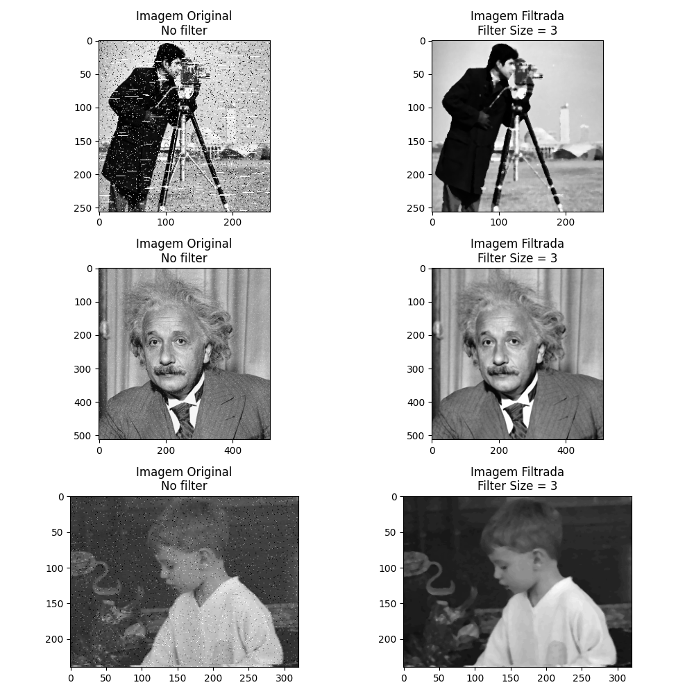

<div align="center">
<h1 style="font-weight: bold;">Filtro de Mediana para Imagens em PGM💻</h1>


</div>

<div align="center">


</div>


<p align="center">

  [Instalação das dependências](#Instalação-das-dependências)

</p>


## Introdução Filtro de Mediana

O processamento de imagens é uma área essencial em diversos campos, como medicina, fotografia e visão computacional. Um dos problemas mais comuns no tratamento de imagens é a presença de ruídos, que podem afetar a qualidade visual e a precisão de análises automáticas. 

O filtro de mediana se destaca como uma técnica eficaz para a remoção de ruídos, preservando as bordas e os detalhes das imagens. Diferente de outros filtros de suavização, ele substitui o valor de cada pixel pela mediana dos pixels vizinhos, o que ajuda a minimizar distorções causadas por ruídos impulsivos (como o ruído de "sal e pimenta"). 

Este projeto implementa um filtro de mediana aplicado a imagens no formato PGM, uma maneira simples e eficiente de melhorar a qualidade das imagens sem sacrificar seus detalhes importantes.

## Descrição

Este projeto implementa um filtro de mediana aplicado a imagens no formato PGM (Portable GrayMap). O objetivo é reduzir ruídos presentes nas imagens enquanto preserva os detalhes importantes, como bordas e contornos. Utilizando a biblioteca PIL e funções de processamento em Python, o filtro é capaz de suavizar imagens ruidosas e exibi-las antes e depois do processamento, facilitando a visualização dos resultados.



## Funcionalidades

O projeto oferece as seguintes funcionalidades principais:

- **Renderização de Imagens PGM**: Permite carregar e visualizar imagens no formato PGM (Portable GrayMap) ou arrays NumPy representando imagens em escala de cinza.
  
- **Aplicação de Filtro de Mediana**: Aplica um filtro de mediana customizável a imagens, reduzindo ruídos e preservando detalhes importantes, como bordas e contornos. O tamanho da janela do filtro pode ser ajustado para personalizar o nível de suavização.
  
- **Visualização Comparativa**: Exibe lado a lado a imagem original e a imagem filtrada por mediana, facilitando a comparação dos resultados antes e depois do processamento.
  
- **Processamento de Múltiplas Imagens**: Permite o processamento e visualização de várias imagens em um único passo, exibindo todas as imagens originais e filtradas em um layout organizado.
  
- **Compatibilidade com Arrays NumPy**: Além de arquivos PGM, o projeto também suporta imagens carregadas diretamente como arrays NumPy, permitindo flexibilidade no uso.

## Instalação

Para executar este projeto, você precisará instalar algumas bibliotecas em Python. Siga os passos abaixo para configurar o ambiente:

1. Clone o repositório do projeto:
   ```
   git clone <URL-do-repositório>
   ```
2. Navegue até o diretório do projeto:
    ```
    cd nome-do-projeto
    ```
3. Instale as dependências necessárias utilizando o pip:
    - Esses pacotes são utilizados para carregar, processar e exibir as imagens, além de manipular dados durante a execução do filtro de mediana.
    ```
    pip install pillow
    pip install matplotlib
    pip install pandas
    ```
## Como Usar

Após a instalação das dependências e configuração do ambiente, você pode começar a usar o projeto para aplicar o filtro de mediana em imagens. Siga os passos abaixo:

1. **Prepare suas imagens**:
   - Coloque as imagens no formato PGM que deseja processar dentro de uma pasta chamada `pgm` no diretório raiz do projeto.

2. **Execute o script**:
   - Para aplicar o filtro de mediana e visualizar os resultados, basta executar o script principal:
    ```
    python medianFilter.py
    ```

## Estrutura do Código

O projeto está organizado de forma a facilitar o processamento e a visualização de imagens com o filtro de mediana. Abaixo estão descritos os principais componentes do código:

1. **renderPGM(img, axis='on')**:
   - Esta função é responsável por carregar e renderizar uma imagem no formato PGM ou um array NumPy, utilizando a biblioteca Pillow para leitura e o Matplotlib para exibição.
   - Parâmetros:
     - `img`: Caminho do arquivo de imagem ou array NumPy.
     - `axis`: Define se os eixos devem ser exibidos ('on') ou ocultados ('off').

2. **apply_median_filter_1d(image_path, filter_size=9)**:
   - Aplica um filtro de mediana em uma imagem em escala de cinza. O filtro substitui o valor de cada pixel pela mediana de seus vizinhos, suavizando a imagem e removendo ruídos.
   - Parâmetros:
     - `image_path`: Caminho da imagem a ser processada.
     - `filter_size`: Tamanho da janela de vizinhança para o filtro de mediana (valor padrão é 9).

3. **plot_single_image_median_filter(results)**:
   - Plota lado a lado a imagem original e a imagem filtrada por mediana.
   - Parâmetros:
     - `results`: Dicionário contendo as imagens originais, as imagens filtradas e os títulos para exibição.

4. **plot_all_image_median_filter(results, figx=10, figy=10)**:
   - Exibe todas as imagens (originais e filtradas) em um layout de grade. O tamanho da figura pode ser ajustado pelos parâmetros `figx` e `figy`.
   - Parâmetros:
     - `results`: Dicionário com as imagens e títulos.
     - `figx`: Largura da figura em polegadas (padrão 10).
     - `figy`: Altura da figura em polegadas (padrão 10).

5. **process_images_with_median_filter(paramMedian)**:
   - Processa todas as imagens no diretório `pgm`, aplica o filtro de mediana com o tamanho de janela especificado e armazena os resultados (imagens originais e filtradas) em um dicionário.
   - Parâmetros:
     - `paramMedian`: Tamanho da janela de vizinhança para o filtro de mediana.

### Arquivo Principal

- **medianFilter.py**:
   - O arquivo principal do projeto. Ele aplica o filtro de mediana a todas as imagens encontradas na pasta `pgm`, exibindo os resultados através das funções de visualização disponíveis.
   - Pode ser executado diretamente para processar imagens e exibir os resultados.

### Estrutura de Pastas

```
|-- pgm/                # Diretório onde devem ser colocadas as imagens PGM a serem processadas
|-- medianFilter.py  # Arquivo principal contendo as funções e lógica de processamento
```

## Exemplo de Uso

Este exemplo demonstra como usar o projeto para aplicar o filtro de mediana em imagens PGM e visualizar os resultados. 

### Passos:

1. **Adicione suas imagens**: 
   - Coloque os arquivos de imagem no formato PGM dentro do diretório `pgm` que deve estar na raiz do projeto.

2. **Execute o script**:
   - Para processar as imagens com o filtro de mediana e exibir os resultados, execute o seguinte comando no terminal:
   ```
   python medianFilter.py
   ```

3. **Resultados**:
    - O programa aplicará o filtro de mediana a todas as imagens encontradas na pasta `pgm`.
    - Ele exibirá gráficos comparando cada imagem original com a versão filtrada, mostrando as mudanças causadas pelo filtro.
    - Os gráficos serão exibidos de duas formas:
        - Visualização em grade: Todas as imagens originais e filtradas são exibidas em uma única figura, lado a lado.
        - Visualização individual: Para cada par de imagens, uma visualização é exibida separadamente.

**Personalizando o Tamanho do Filtro**

- Se você quiser modificar o tamanho da janela do filtro de mediana, basta alterar o parâmetro na função process_images_with_median_filter dentro do código:
    ```
    imgstratadas = process_images_with_median_filter(5)  # Aplicando filtro de mediana com janela de 5x5
    ```

## Exemplo de Saída
1. Exemplo com imagem única:
    Após a execução, você verá algo assim:

    Imagem Original vs Imagem Filtrada: A imagem original pode conter ruídos (como ruído "sal e pimenta"), e após a aplicação do filtro de mediana, o ruído será reduzido, preservando os detalhes e bordas.
    

2. Exemplo com todas as imagem em um unico arquivo:
    


## Dependências

Este projeto requer a instalação de algumas bibliotecas Python para funcionar corretamente. Abaixo estão as dependências necessárias:

1. **Pillow (PIL)**:
   - Biblioteca para abrir, manipular e salvar diferentes formatos de imagem. É utilizada para carregar as imagens no formato PGM e convertê-las para escala de cinza.
   - Instalação:
     ```
     pip install pillow
     ```

2. **Matplotlib**:
   - Utilizada para exibir as imagens e gráficos, facilitando a visualização comparativa das imagens originais e filtradas.
   - Instalação:
     ```
     pip install matplotlib
     ```

3. **NumPy**:
   - Necessária para a manipulação de arrays, a NumPy permite que as imagens sejam representadas como matrizes e facilita o processamento dos pixels ao aplicar o filtro de mediana.
   - Instalação:
     ```
     pip install numpy
     ```

## Instalação das dependências
Você pode instalar todas as dependências de uma só vez usando o seguinte comando:

   ```
   pip install pillow matplotlib numpy
   ```